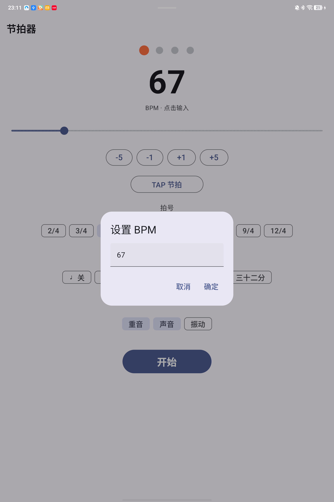

# 🎵 节拍器 (Metronome)

一个 Android 原生节拍器应用，使用 Kotlin + Jetpack Compose 开发。

## ⬇️ 下载安装

在 [Releases](../../releases/latest) 页面下载 `app-debug.apk`，传到手机直接点击安装即可。
- 需 Android 8.0（API 26）及以上
- 安装时允许「未知来源」

## ✨ 功能

- **采样级精确节拍**：基于 `AudioTrack` 硬件时钟，长时间运行零漂移
- **BPM 30–250**：滑块拖动 / ±1±5 步进 / TAP 节拍 / 点击数字直接输入
- **拍号**：2/4 ~ 12/4
- **细分节奏**：八分 / 三连 / 十六分 / 三十二分（带对应音符图标）
- **重音**：第一拍高音 + 暖色高亮
- **声音 / 振动 / 重音** 独立开关
- **后台播放**：前台服务 + MediaSession + 通知栏（含停止按钮），锁屏继续
- **设置持久化** & **屏幕常亮**

## 📸 截图

## 🛠 技术栈

Kotlin · Jetpack Compose · AudioTrack · MediaSession · minSdk 26 / targetSdk 34
